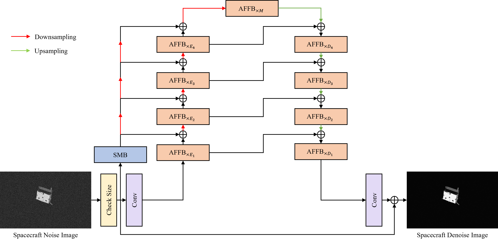

# Structure Modeling Activation Free Fourier Network for Spacecraft Image Denoising

**Abstract:** Spacecraft image denoising is a crucial fundamental technology closely related to aerospace research. However, the existing deep learning-based image denoising methods are primarily designed for natural image and fail to adequately consider the characteristics of spacecraft image(e.g. low-light conditions, repetitive periodic structures), resulting in suboptimal performance in the spacecraft image denoising task. To address the aforementioned problems, we propose a Structure modeling Activation Free Fourier Network (SAFFN), which is an efficient spacecraft image denoising method including Structure Modeling Block (SMB) and Activation Free Fourier Block (AFFB). We present SMB to effectively extract edge information and model the structure for better identification of spacecraft components from dark regions in spacecraft noise image. We present AFFB and utilize an improved Fast Fourier block to extract repetitive periodic features and long-range information in noisy spacecraft image. Extensive experimental results demonstrate that our SAFFN performs competitively compared to the state-of-the-art methods on spacecraft noise image datasets. 

## Network Architecture

